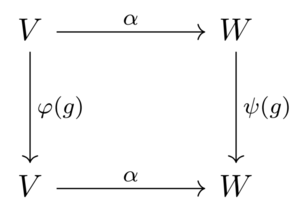

# SchurNet


Equivariant Linear Layers and Wreath Product Groups
This repository explores the characterization of equivariant linear layers for representations of permutations and related groups. Instead of traditional parameter-sharing, the approach relies on irreducible representations and Schur’s lemma, providing new insights into existing models like:
This repo contains code for the experimental part of the paper ["Revisiting Multi-Permutation Equivariance Thourgh The Lens of Irreducible Representations"](https://arxiv.org/abs/2410.06665).

## Installation
To create a conda environment that is good for all experiments, please run 
```bash
git clone git@github.com:yonatansverdlov/SchurNet.git
cd SchurNet
conda env create -f dependencies.yml 
conda activate SchurNet
```
## Graph Matching
In this experiment, we highlight the need of all linear equivariant layers. 
Choose a `model_type` in `Siamese`, `SchurNet`, and `DSS`. Choose `noise_level` and run:
```bash
cd graph_matching
python train.py --model_type model_type --noise noise_level
```
## Wasserstein Distance Computation
### Data
Run the following code:
```bash
cd Wasserstein_Distance
python -c "import kagglehub, shutil, os; os.makedirs('./data/samples', exist_ok=True); p=kagglehub.dataset_download('yonatansverdlov/data-for-wasserstein-distance-computation'); [shutil.move(os.path.join(p, f), os.path.join('./data/samples', f)) for f in os.listdir(p)]; shutil.rmtree(p, ignore_errors=True); print('Dataset downloaded directly to: ./data/samples')"
```
### Training
Choose `set_name` in `ncircle3`, `ncircle6`, `random`, `mn_small`, `mn_large`, `rna`.
After downloading the data, please run the following command to start the training process:
```bash
python train_wd.py --dataset_name set_name
```
## Deep Weight Space Alignment
### Data
Choose `data_name` to be `mnist` or `cifar10`.

### MNIST MLP
To run the MLP experiments, first download the data:
```bash
cd DWS
mkdir -p data
wget "https://www.dropbox.com/s/sv85hrjswaspok4/mnist_classifiers.zip" -P data
unzip -q data/mnist_classifiers.zip -d data/samples
python utils/data_utils/generate_splits.py --data_name mnist
```
### CIFAR10 MLP
To run the MLP experiments, first download the data:
```bash
cd DWS
mkdir -p data
wget -O data/cifar_classifiers.zip "https://www.dropbox.com/scl/fi/lex7rj1147nhq2hsp83r1/cifar10_mlps.zip?rlkey=tiyq14zl70hjbmhq2y9sg14xo&dl=1"
unzip -q data/cifar_classifiers.zip -d data/samples
python utils/data_utils/generate_splits.py --data_name cifar10
```
### Training
For our model with the shared layers run:
```bash
python trainer.py --data_name data_name --add_common True
```
For the baseline of Siamese model, run:
```bash
python trainer.py --data_name data_name --add_common False
```

## Citation
```
@inproceedings{sverdlov2025revisiting,
      title={Revisiting Multi-Permutation Equivariance through the Lens of Irreducible Representations}, 
      author={Yonatan Sverdlov and Ido Springer and Nadav Dym},
      booktitle={International Conference on Learning Representations (ICLR)},
      year={2025},
      eprint={2410.06665},
      archivePrefix={arXiv},
      primaryClass={cs.LG},
      url={https://arxiv.org/abs/2410.06665}
}

```
